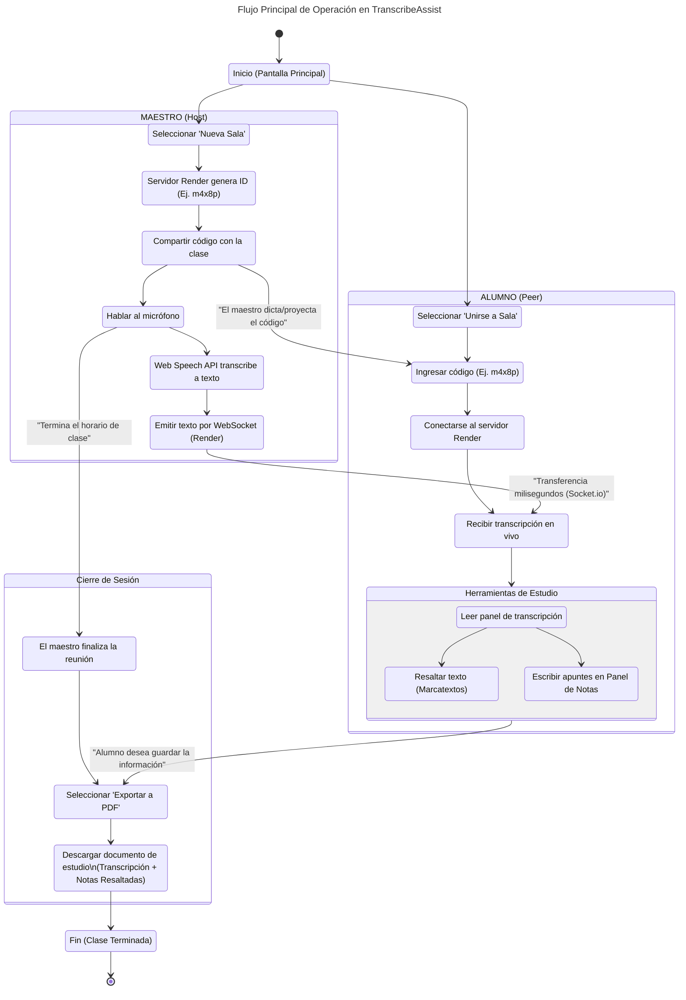

# Diagrama de Actividad — TranscribeAssist

El siguiente diagrama de actividad modela el flujo esperado y natural de uso del sistema. Cubre desde el momento en que el maestro inicia una clase (creando la sala y generando un código de sesión), hasta que los alumnos se conectan, consumen la transcripción, toman notas personales y, al finalizar la clase, proceden a descargar el material (transcripción + notas).

## Explicación del Flujo
1. **Inicio de la Dinámica**: Ambos usuarios (Maestro y Alumno) parten de la pantalla principal. El Maestro opta por hostear la sala; el sistema mediante *Socket.io* conectando con *Render* le asigna una sala exclusiva, devolviéndole un código alfanumérico corto.
2. **Distribución del Código**: El Maestro dicta o proyecta el código a su clase.
3. **Unión de Alumnos**: Cada Alumno ingresa a la opción *Unirse a Sala*, digita el código corto, y en tiempo récord su dispositivo abre la conexión WebSocket.
4. **Flujo de Trabajo (Real-Time)**:
    * El Maestro imparte su materia normalmente. El micrófono, junto con *Web Speech API*, detecta su voz y la transforma en texto.
    * Ese texto es subido al servidor en Render y retransmitido a toda la sala de alumnos casi instantáneamente.
5. **Estudio Activo**: Los alumnos ven el texto llegar. Si algo les parece importante, utilizan su *marcatextos virtual*. Si recuerdan un concepto clave de la lectura o quieren agregar algo, usan el *Panel de Notas*. Las notas se guardan de forma volátil en la RAM interactuando simultáneamente con la transcripción en vivo.
6. **Cierre de Ciclo**: Al terminar la sesión, el alumno (o incluso el maestro) procede a usar el módulo de *Exportación PDF*. En tan solo un clic, la herramienta encapsula sus resaltados de colores y sus notas privadas en un documento local descargable. Ningún dato queda alojado en un servidor externo. Todo cumple su propósito, de la voz al papel (digital).
